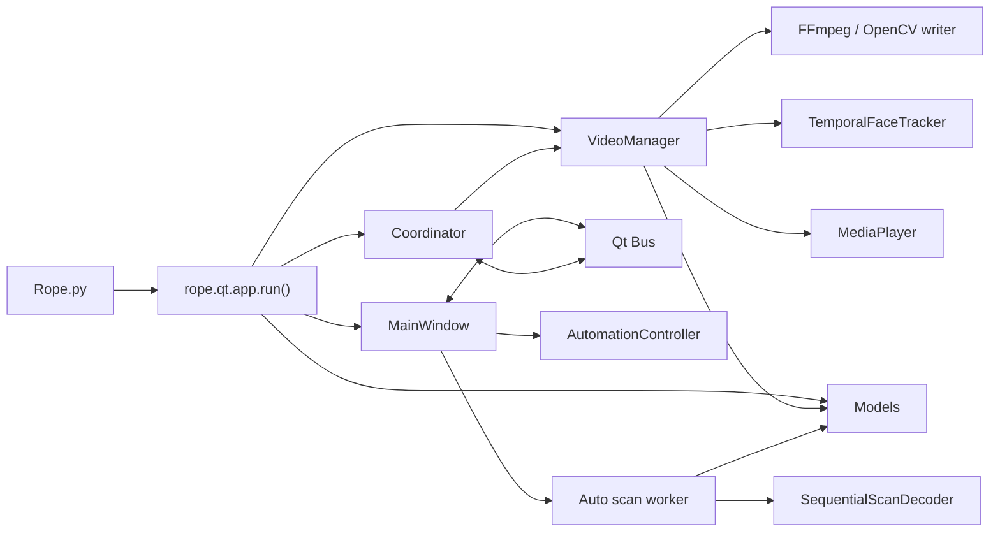
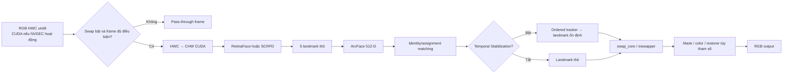

# Kiến trúc hiện tại

## Bản đồ tổng quát

`Bus` là control plane giữa widget và backend. Frame preview đi theo push callback từ `VideoManager` qua `Coordinator._on_vm_frame()` rồi emit `bus.frame_ready`; không còn được drain bởi timer.

## Module và trách nhiệm

| Module | Trách nhiệm hiện tại | Không nên đặt vào đây |
|---|---|---|
| [`Rope.py`](../Rope.py) | Entrypoint tối thiểu | Logic UI/model |
| [`rope/qt/app.py`](../rope/qt/app.py) | Tạo `QApplication`, model, VM, window, coordinator; áp settings/backend | Xử lý frame |
| [`rope/qt/main_window.py`](../rope/qt/main_window.py) | Orchestrate UI, source/target assignment, Auto Job, scan/QC worker | Kernel model hoặc media decode |
| [`rope/qt/bus.py`](../rope/qt/bus.py) | Danh sách signal có kiểu | State nghiệp vụ lâu dài |
| [`rope/qt/coordinator.py`](../rope/qt/coordinator.py) | Nối signal vào VM, seed state, telemetry, frame bridge | Công việc CUDA nặng |
| [`rope/VideoManager.py`](../rope/VideoManager.py) | Media session, scheduler, scrub, swap, record, Auto Render | Widget hoặc dialog |
| [`rope/MediaPlayer.py`](../rope/MediaPlayer.py) | Demux/decode, seek, queue video, audio ring và audio-clock sync | Face detection/swap |
| [`rope/Models.py`](../rope/Models.py) | Lazy session, detector, recognizer, swapper, restorer/mask | UI/job state |
| [`rope/TensorRTEngine.py`](../rope/TensorRTEngine.py) | Hỗ trợ engine TensorRT | Orchestration UI |
| [`rope/FaceTracking.py`](../rope/FaceTracking.py) | Ordered temporal association và One Euro stabilization | Scan segment |
| [`rope/AutoSegments.py`](../rope/AutoSegments.py) | Decode tuần tự khi scan, group/mark segment, scan cache primitives | Render video |
| [`rope/Automation.py`](../rope/Automation.py) | State machine và atomic job store, không phụ thuộc Qt/CUDA | Chạy worker/UI |
| [`rope/MediaCache.py`](../rope/MediaCache.py) | Cache thumbnail/face data trên đĩa | Job checkpoint |
| [`rope/EmbeddingMerge.py`](../rope/EmbeddingMerge.py) | Kết hợp nhiều embedding nguồn | Detect/recognize |
| [`rope/qt/thumbnails.py`](../rope/qt/thumbnails.py) | Load thumbnail nền, generation chống result cũ | Source embedding lifecycle |
| [`rope/qt/window_capture.py`](../rope/qt/window_capture.py) | Capture DXGI/mss và worker pool riêng | Video timeline |

## Cấu trúc Qt

- `panes/left_pane.py`: danh sách target media và source faces.
- `panes/center_pane.py`: preview, transport, timeline, Found Faces và Embeddings.
- `panes/parameters_pane.py`: sinh control từ schema tham số, settings/model table.
- `widgets/preview.py`: `QOpenGLWidget`, có fast path CUDA–OpenGL và CPU fallback.
- `widgets/timeline.py`: playhead, marker và segment overlay.
- `widgets/auto_segments_dialog.py`: review segment, preview, approve/split/merge và điều khiển job.
- `parameters.py`: schema/default của parameter và control.
- `parameters_migration.py`: load/save snapshot tham số tương thích.
- `settings.py`: cấu hình UI/folder/backend trong `data.json`.

## Ownership của state

| State | Owner | Consumer |
|---|---|---|
| Widget values, selection, dialog | `MainWindow` và pane/widget | `Bus`, Auto Job request |
| `control`, `parameters`, marker, found faces | `VideoManager` sau khi nhận snapshot | Per-frame pipeline |
| Decoder, FPS, frame count, audio clock | `MediaPlayer` | `VideoManager` |
| Model session/backend/buffer | `Models` | UI worker và VM worker |
| Temporal track sequence | `TemporalFaceTracker` trong VM | Video swap pipeline |
| Job state bền vững | `AutomationController/JobStore` | `MainWindow` |
| Render checkpoint/part | `VideoManager` manifest | Resume Auto Render |
| Scan checkpoint/chunk | Scan manifest | `_AutoScanWorker` |

Không để hai owner cùng mutate một object. UI gửi snapshot `dict/list`; worker không giữ tham chiếu mutable vào widget.

## Thread model

| Luồng | Công việc |
|---|---|
| Qt GUI thread | Widget, dialog, signal cùng thread, `Coordinator._tick()` |
| `MediaPlayer` decode thread | Decode video tuần tự và đẩy frame vào queue |
| `MediaPlayer` audio thread/callback | Decode audio, ring buffer, DAC clock |
| VM executor | Nhiều `thread_video_read()` detect/recognize/swap song song |
| VM worker đi qua ordered gate | `TemporalFaceTracker` dùng `Condition` để tuần tự hóa association/filter theo `frame_number`; không có tracker thread riêng |
| VM pacer | Chọn frame hoàn tất theo thứ tự/clock và publish |
| Scrub daemon | Decode + swap request scrub theo FIFO hiện tại |
| Qt global thread pool | Auto scan, Auto QC, thumbnail workers |
| Capture worker pool | Xử lý frame capture độc lập |

Mỗi swap worker có CUDA stream riêng và model session có thể dùng `Shared` hoặc `Per-Thread`. Temporal tracker chỉ giữ worker tại ordered gate trong phần matching/filter; swap tiếp tục song song sau khi worker nhận landmark ổn định.

## Pipeline GPU theo frame

ArcFace vẫn nhận landmark thô để identity không bị ảnh hưởng bởi smoothing. Landmark ổn định chỉ đi vào alignment/swap.

## Backend và model lifecycle

- Model lazy-load khi đường code đầu tiên cần nó; nút Preload Models chỉ khởi tạo sớm.
- Backend preference nằm trong `Settings.model_backends`: `trt`, `onnx`, hoặc thiếu key nghĩa là auto.
- TensorRT EP có profile input riêng; RetinaFace đang clamp input theo profile 320–640 khi TRT active.
- Per-thread session và CUDA stream phải được quản lý theo worker; không chia sẻ mutable I/O binding giữa worker.
- Thay models folder/backend phải unload/rebuild session theo API hiện có, không sửa trực tiếp thuộc tính session từ UI.
