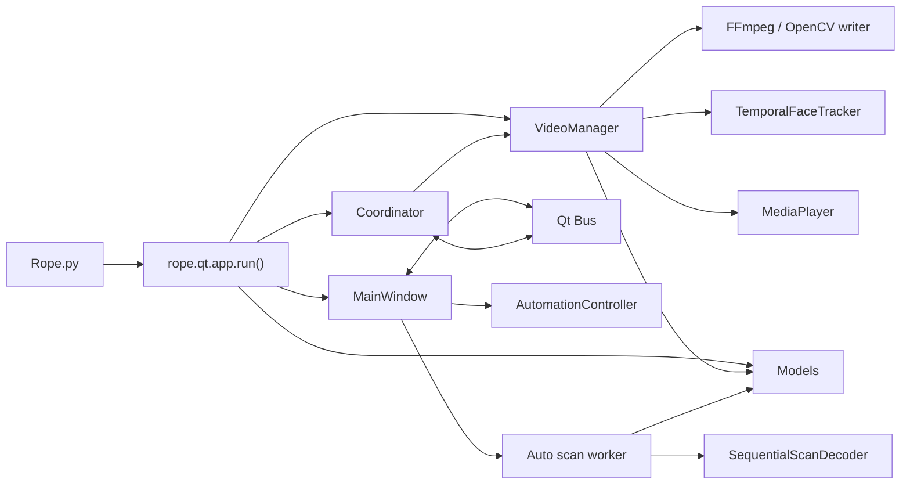

# Current Architecture

## High-level map

`Bus` is the control plane between widgets and the backend. Preview frames are pushed from `VideoManager` through `Coordinator._on_vm_frame()` and emitted as `bus.frame_ready`; they are no longer drained by the coordinator timer.

## Modules and responsibilities

| Module | Current responsibility | Does not belong here |
|---|---|---|
| [`Rope.py`](../Rope.py) | Minimal application entrypoint | UI or model logic |
| [`rope/qt/app.py`](../rope/qt/app.py) | Creates `QApplication`, models, VM, window, and coordinator; applies settings and backend preferences | Frame processing |
| [`rope/qt/main_window.py`](../rope/qt/main_window.py) | Orchestrates UI, source/target assignment, Auto Jobs, scan workers, and QC workers | Model kernels or media decoding |
| [`rope/qt/bus.py`](../rope/qt/bus.py) | Typed signal definitions | Long-lived business state |
| [`rope/qt/coordinator.py`](../rope/qt/coordinator.py) | Connects signals to VM, seeds state, reports telemetry, and bridges frames | Heavy CUDA work |
| [`rope/VideoManager.py`](../rope/VideoManager.py) | Media session, scheduler, scrubbing, swapping, recording, and Auto Render | Widgets or dialogs |
| [`rope/MediaPlayer.py`](../rope/MediaPlayer.py) | Demuxing, decoding, seeking, video queues, audio ring buffer, and audio-clock synchronization | Face detection or swapping |
| [`rope/Models.py`](../rope/Models.py) | Lazy sessions, detectors, recognizer, swapper, restorers, and mask models | UI or job state |
| [`rope/TensorRTEngine.py`](../rope/TensorRTEngine.py) | TensorRT engine support | UI orchestration |
| [`rope/FaceTracking.py`](../rope/FaceTracking.py) | Ordered temporal association and One Euro stabilization | Segment scanning |
| [`rope/AutoSegments.py`](../rope/AutoSegments.py) | Sequential scan decoding, segment grouping/review flags, and scan-cache primitives | Video rendering |
| [`rope/Automation.py`](../rope/Automation.py) | Qt/CUDA-independent Auto Job state machine and atomic job store | Worker execution or UI |
| [`rope/MediaCache.py`](../rope/MediaCache.py) | On-disk thumbnail and face data cache | Job checkpoints |
| [`rope/EmbeddingMerge.py`](../rope/EmbeddingMerge.py) | Combines multiple source embeddings | Detection or recognition |
| [`rope/qt/thumbnails.py`](../rope/qt/thumbnails.py) | Background thumbnail loading with generation-based stale-result rejection | Source embedding lifecycle |
| [`rope/qt/window_capture.py`](../rope/qt/window_capture.py) | DXGI/mss capture and its worker pool | Video timeline behavior |

## Qt structure

- `panes/left_pane.py`: target media and source face lists.
- `panes/center_pane.py`: preview, transport controls, timeline, Found Faces, and Embeddings.
- `panes/parameters_pane.py`: generates controls from the parameter schema and hosts settings/model status.
- `widgets/preview.py`: `QOpenGLWidget` with a CUDA–OpenGL fast path and CPU fallback.
- `widgets/timeline.py`: playhead, markers, and segment overlays.
- `widgets/auto_segments_dialog.py`: segment review, preview, approval, split/merge, and job controls.
- `parameters.py`: parameter/control schemas and defaults.
- `parameters_migration.py`: compatible parameter snapshot loading and saving.
- `settings.py`: UI, folder, and backend preferences stored in `data.json`.

## State ownership

| State | Owner | Consumer |
|---|---|---|
| Widget values, selection, and dialog state | `MainWindow` and pane/widget instances | `Bus`, Auto Job requests |
| `control`, `parameters`, markers, and found faces | `VideoManager` after receiving snapshots | Per-frame pipeline |
| Decoder, FPS, frame count, and audio clock | `MediaPlayer` | `VideoManager` |
| Model sessions, backends, and buffers | `Models` | UI workers and VM workers |
| Temporal tracking sequence | `TemporalFaceTracker` inside VM | Video swap pipeline |
| Durable job state | `AutomationController/JobStore` | `MainWindow` |
| Render parts and checkpoints | `VideoManager` render manifest | Auto Render resume |
| Scan chunks and checkpoints | Scan manifest | `_AutoScanWorker` |

Do not let two owners mutate the same object. UI code sends `dict` or `list` snapshots; workers must not keep mutable references to widgets.

## Thread model

| Execution context | Work performed |
|---|---|
| Qt GUI thread | Widgets, dialogs, same-thread signals, and `Coordinator._tick()` |
| `MediaPlayer` decode thread | Sequential video decoding into the frame queue |
| `MediaPlayer` audio thread/callback | Audio decoding, ring buffer, and DAC clock |
| VM executor | Multiple parallel `thread_video_read()` detect/recognize/swap tasks |
| VM workers at the ordered gate | `TemporalFaceTracker` uses a `Condition` to serialize association/filtering by `frame_number`; there is no dedicated tracker thread |
| VM pacer | Selects completed frames in timeline/clock order and publishes them |
| Scrub daemon | Decodes and swaps queued scrub requests in the current FIFO design |
| Qt global thread pool | Auto scan, Auto QC, and thumbnail workers |
| Capture worker pool | Independent screen-capture frame processing |

Each swap worker owns a CUDA stream, and model sessions can use `Shared` or `Per-Thread` mode. The temporal tracker holds a worker only at the ordered matching/filtering gate; swapping continues in parallel after the worker receives stabilized landmarks.

## Per-frame GPU pipeline

ArcFace always receives raw detector landmarks so smoothing does not alter identity matching. Stabilized landmarks are used only for alignment and swapping.

## Backend and model lifecycle

- Models load lazily when first required; **Preload Models** only initializes them earlier.
- Backend preferences live in `Settings.model_backends`: `trt`, `onnx`, or no key for automatic selection.
- TensorRT EP uses explicit input profiles; RetinaFace currently clamps TRT input sizes to its 320–640 profile.
- Per-thread sessions and CUDA streams must remain worker-local; never share a mutable I/O binding between workers.
- Changes to the model folder or backend must unload/rebuild sessions through existing APIs rather than mutating session attributes directly from UI code.
