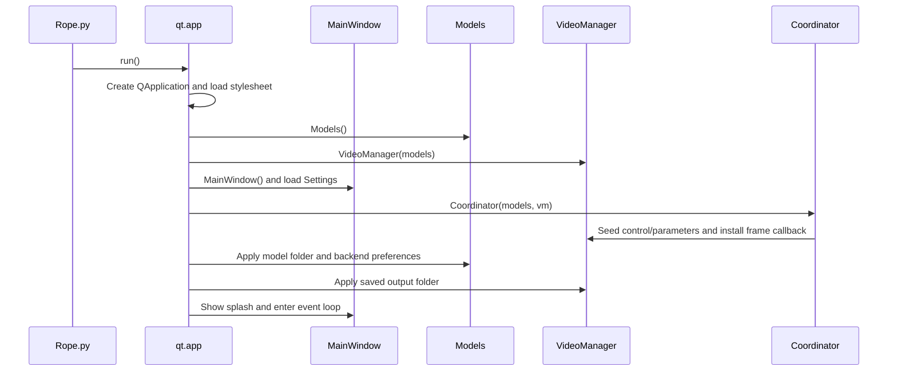
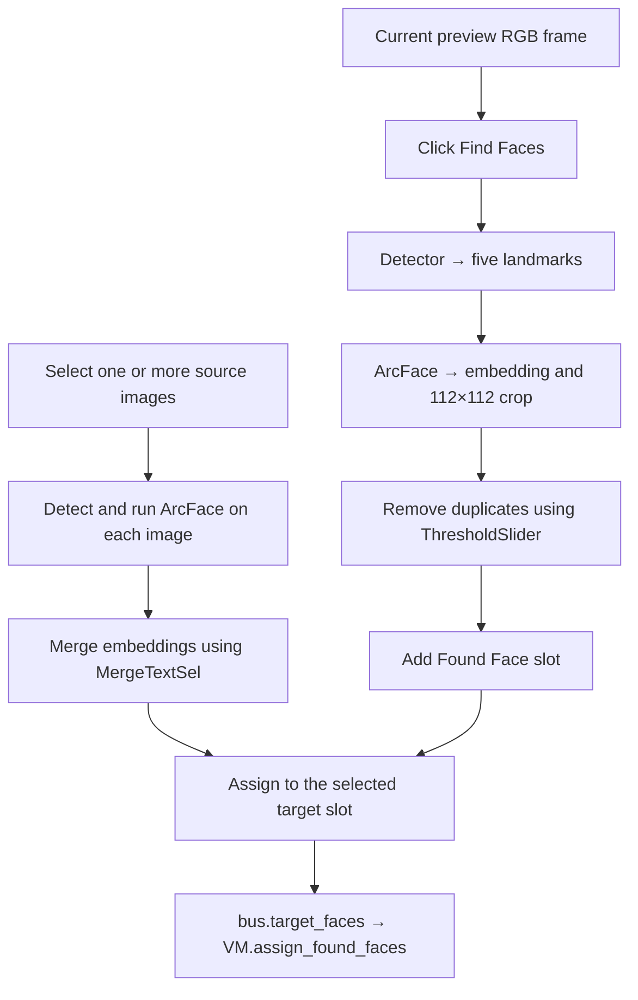
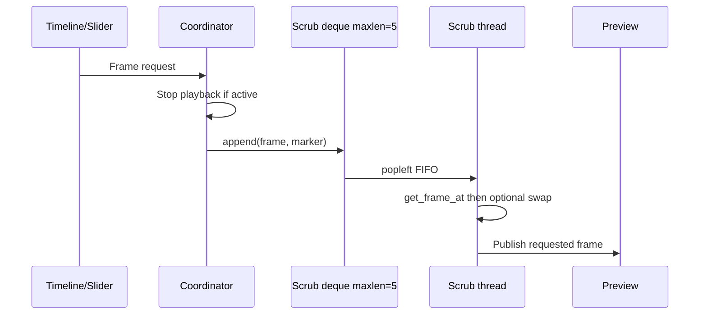
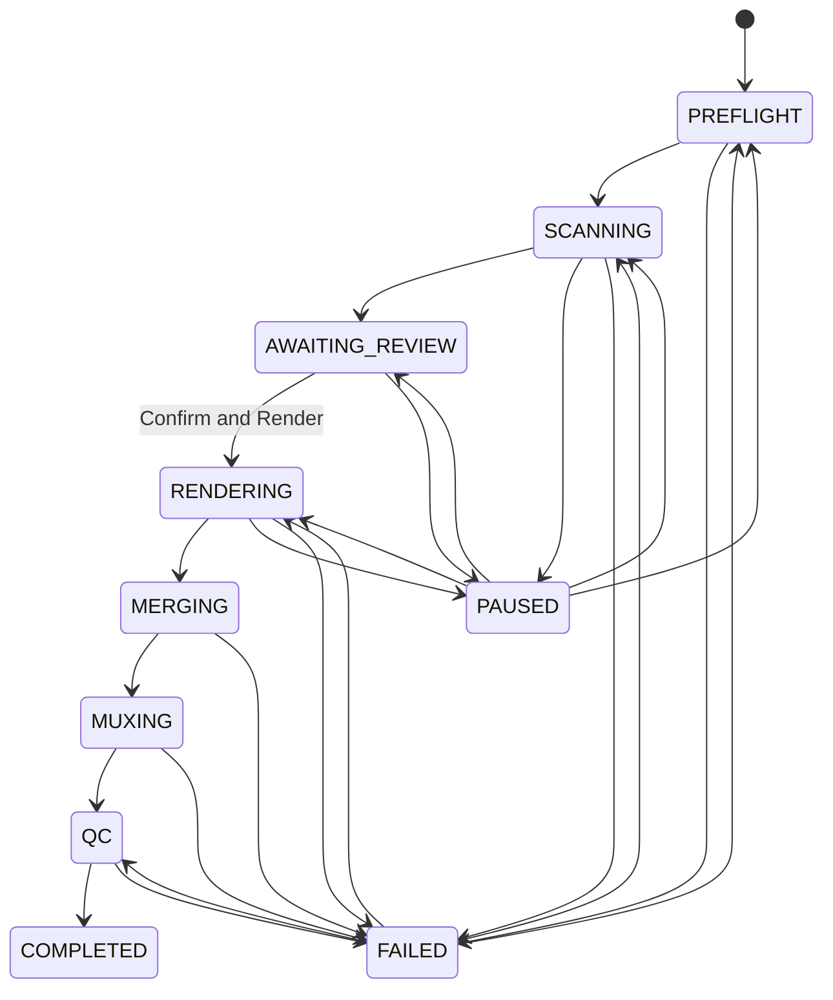
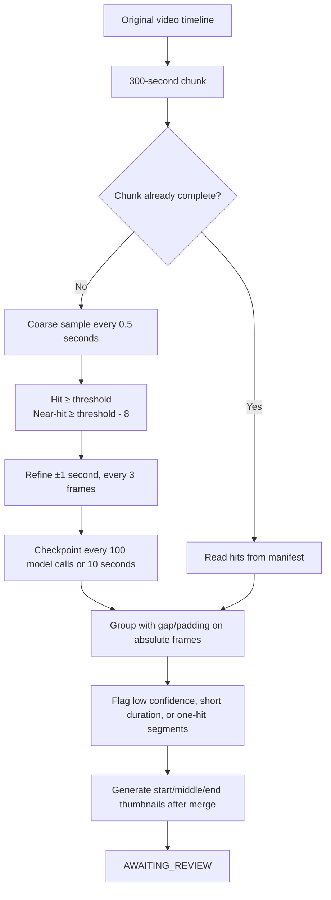

# Current Runtime Flows

## 1. Startup

Models are not preloaded automatically at startup. Sessions are created lazily or when the user clicks **Preload Models**.

## 2. Selecting target media

1. `TargetMediaPanel` sends the selected path to `MainWindow._on_target_media_clicked()`.
2. The window classifies it as an image or video and emits `bus.load_target_image` or `bus.load_target_video`.
3. `Coordinator` connects the signal directly to `VideoManager.load_target_*()`.
4. For video, VM closes the previous player, creates `MediaPlayer`, reads FPS/frame count/dimensions, resets face/orientation/timeline state, and requests the first frame.
5. VM publishes the frame through its callback; Coordinator emits `frame_ready`; the preview renders on the GUI thread.

Creating `MediaPlayer` and reading the first frame can currently run on the GUI thread. This is tracked as a performance backlog item.

## 3. Finding faces and assigning a source

A slot is eligible for swapping only when it has:

- `Embedding`: target identity.
- `SourceFaceAssignments`: source paths or embedding labels.
- `AssignedEmbedding`: merged source embedding.

The pipeline skips target-only slots without an assignment. Source embeddings are currently cached only in memory for the active process; durable face caching is a backlog item.

## 4. Preview playback

1. `play_video("play")` resets process slots, creates or resizes the executor, and starts a temporal sequence when enabled.
2. `MediaPlayer.seek()` and `start_playback()` start background decoding; audio output follows the Audio control.
3. `VideoManager.process()` takes predecoded frames without blocking and dispatches them into clear worker slots.
4. A worker runs `thread_video_read()`; ineligible frames pass through, while eligible frames enter `swap_video()`.
5. The result is stored in the matching process slot with `FrameNumber`, `Status`, and `Pts`.
6. The pacer selects the lowest completed frame. It uses DAC audio time when audio is active, otherwise wall-clock pacing.
7. The frame is pushed to the preview. Stop aborts the temporal generation, stops playback, and returns the playhead to the lowest unpresented frame.

A process slot currently retains `ProcessedFrame` after its status is cleared. Releasing that reference is listed as a quick win in the backlog.

## 5. Scrubbing and timeline requests

The current GUI path does not debounce or coalesce requests. Up to five requests remain queued, and every request still in the queue is processed. `ParameterSlider` also has paths that can emit twice. The target design is a 16–33 ms debounce with latest-only pending work; see the performance backlog.

## 6. Per-frame face swap and temporal tracking

For each eligible frame:

1. Convert the frame to a CUDA CHW tensor when required.
2. The detector returns five-point landmark candidates.
3. ArcFace consumes raw landmarks and returns a 512-D embedding.
4. Compare identity against Found Face slots and verify source assignments.
5. With Temporal Stabilization off, pass raw landmarks directly to `swap_core()`.
6. With it on, observations for every frame—including skip and miss frames—pass through the ordered coordinator.
7. The tracker performs one-to-one association using identity, motion, and scale; a One Euro filter smooths center, log-scale, and angle.
8. One miss may be predicted for exactly one frame after a sufficient hit streak and a stable scene signature; a second miss stops swapping and resets the track.
9. `swap_core()` runs inswapper, optional mask/color/restoration stages, and composites the output.

The tracker resets on generation changes, seek/stop, non-contiguous frames, scene cuts, assignment or orientation changes, and approved-segment gaps. Tracking checkpoints belong to rendering, not scanning.

## 7. Manual recording

1. Recording snapshots the active state, creates process slots, and starts a temporal sequence.
2. Video decoding and swapping use the playback scheduler, but audio is not played.
3. With `RecordTypeTextSel=FFMPEG`, each NumPy frame is currently encoded as BMP through PIL and written to stdin.
4. With OpenCV, frames are written through `cv2.VideoWriter`.
5. At completion, FFmpeg muxes the temporary video with the original audio and removes the temporary file after success.

Auto Render already uses `rawvideo rgb24`; manual FFmpeg recording does not yet reuse that path.

## 8. Review-gated Auto Job

### Preflight

Preflight checks video access, metadata, models, FFmpeg, output folder, disk space, and target/source assignment. The job snapshots the video fingerprint, embeddings, and scan configuration. Video, target, and source inputs remain locked while the job is active.

### Segment scan

`SequentialScanDecoder` owns a separate decoder and advances through requested frames. Chunks use absolute frame numbers, so the source timeline is never physically split. Cancellation saves coarse/refine cursors; resume skips completed chunks.

### Mandatory review

The dialog supports approve/reject, frame-boundary edits, split/merge, segment playback, and select/clear all. `AutomationController.confirm_segments()` accepts only `AWAITING_REVIEW` jobs and requires at least one approved segment. There is no direct transition from scanning to rendering.

### Render, merge, and mux

- Frames outside approved ranges pass through without face detection or swapping.
- Video-only output is rendered in approximately 60-second parts through `rawvideo rgb24`.
- `h264_nvenc` is preferred; a failed capability probe or live encode falls back to `libx264` for the current part.
- Every completed part updates the manifest, `next_frame`, and temporal tracking checkpoint.
- A crash inside a part re-renders that part; completed parts remain reusable.
- Parts are concatenated into a video-only stream, then original audio is muxed exactly once.
- Default output name: `<video>_<source>_autoswap_<timestamp>.mp4`.

### QC and cleanup

QC runs in a worker and checks metadata/timeline, audio, sampled frames, and identity to the extent supported by the current implementation. Passing QC moves the job to `COMPLETED` and removes render parts/checkpoints. Failure keeps artifacts available for retry and moves the job to `FAILED`.

## 9. Image and Capture modes

- Image loading and swapping operate on one static frame and do not create a temporal sequence.
- Capture prefers a DXGI backend and falls back to mss; it owns a separate worker pool.
- Temporal Stabilization does not currently apply to Capture, matching the current contract.
