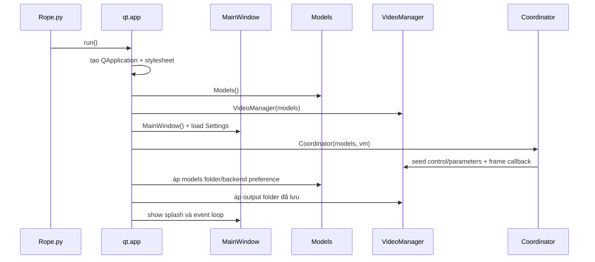
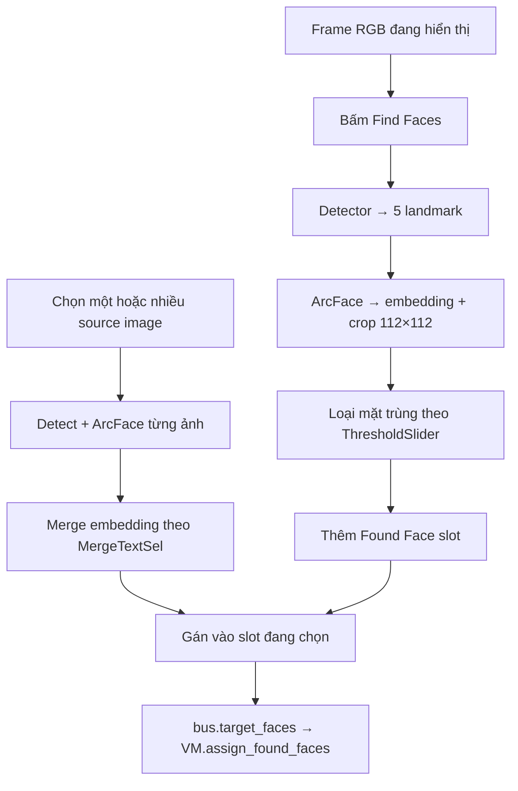
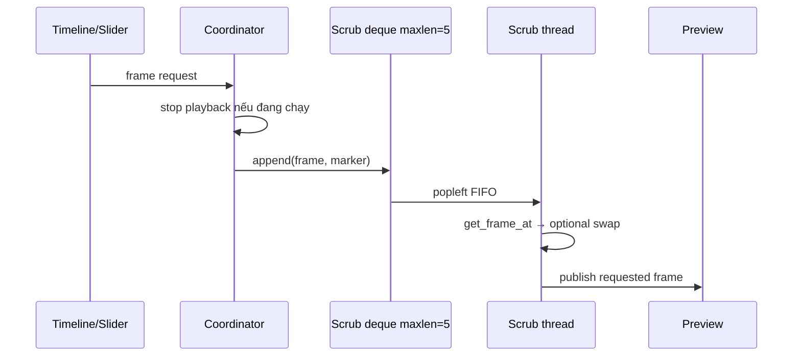
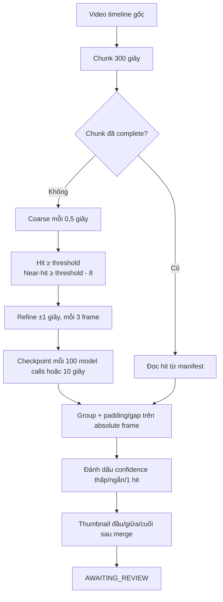

# Flow hoạt động hiện tại

## 1. Startup

Model không tự preload khi startup. Session được tạo lazy hoặc khi user bấm **Preload Models**.

## 2. Chọn target media

1. `TargetMediaPanel` emit đường dẫn vào `MainWindow._on_target_media_clicked()`.
2. Window phân loại ảnh/video rồi emit `bus.load_target_image` hoặc `bus.load_target_video`.
3. `Coordinator` nối trực tiếp signal vào `VideoManager.load_target_*()`.
4. Với video, VM đóng player cũ, tạo `MediaPlayer`, đọc FPS/frame count/kích thước, reset face/orientation/timeline và lấy first frame.
5. VM publish frame qua callback; Coordinator emit `frame_ready`; preview vẽ trên GUI thread.

Hiện tại bước tạo `MediaPlayer` và lấy first frame có thể xảy ra trên GUI thread. Đây là hotspot được theo dõi trong backlog.

## 3. Find Faces và gán source

Một slot hợp lệ để swap cần:

- `Embedding`: identity của target.
- `SourceFaceAssignments`: danh sách source path hoặc embedding label.
- `AssignedEmbedding`: embedding nguồn đã merge.

Slot chỉ có target mà chưa có assignment sẽ bị pipeline bỏ qua. Source embedding hiện chỉ cache trong RAM theo phiên chạy; cache đĩa là một mục backlog.

## 4. Preview playback

1. `play_video("play")` reset process slots, tạo/resize executor, bắt đầu temporal sequence nếu switch bật.
2. `MediaPlayer.seek()` và `start_playback()` mở decode nền; audio output được bật theo Audio control.
3. `VideoManager.process()` lấy frame predecoded không-blocking và dispatch vào slot trống.
4. Worker chạy `thread_video_read()`; frame ngoài điều kiện swap được pass-through, frame còn lại vào `swap_video()`.
5. Kết quả ghi vào đúng process slot với `FrameNumber`, `Status`, `Pts`.
6. Pacer lấy frame hoàn tất có số nhỏ nhất. Nếu có audio thì PTS theo DAC audio clock; nếu không dùng wall clock.
7. Frame được push sang preview. Stop abort temporal generation, dừng playback và đưa playhead về frame thấp nhất chưa trình chiếu.

Process slot hiện giữ `ProcessedFrame` sau khi status được clear; việc giải phóng tham chiếu này nằm trong backlog quick win.

## 5. Scrub/timeline

Hiện trạng không debounce/coalesce ở GUI: tối đa 5 request được giữ và tất cả request còn trong queue đều chạy. `ParameterSlider` cũng có nhánh có thể emit hai lần. Thiết kế đích là debounce 16–33 ms và latest-only, xem backlog.

## 6. Per-frame face swap và temporal tracking

Với mỗi frame đủ điều kiện:

1. Convert frame về tensor CUDA CHW khi cần.
2. Detector trả danh sách 5 landmark.
3. ArcFace nhận landmark thô và trả embedding 512-D.
4. So identity với từng Found Face slot và kiểm tra assignment.
5. Nếu Temporal Stabilization tắt: landmark thô đi thẳng vào `swap_core()`.
6. Nếu bật: observation của mọi frame, kể cả skip/miss, đi qua coordinator có thứ tự.
7. Tracker association one-to-one theo identity, chuyển động và scale; One Euro filter làm mượt center/log-scale/angle.
8. Một miss có thể dự đoán đúng một frame khi đủ hit streak và scene signature ổn; miss thứ hai reset/dừng swap.
9. `swap_core()` chạy inswapper, mask/color/restorer tùy parameter rồi composite output.

Tracker reset khi generation đổi, seek/stop, frame không liên tục, scene cut, assignment/orientation đổi hoặc ra khỏi approved segment. Checkpoint tracking chỉ thuộc render, không thuộc scan.

## 7. Manual record

1. Record snapshot trạng thái hiện tại, tạo process slots và temporal sequence.
2. Video decode và swap dùng cùng scheduler với playback nhưng không phát audio.
3. Với `RecordTypeTextSel=FFMPEG`, hiện tại mỗi numpy frame được PIL encode thành BMP rồi ghi qua stdin.
4. Với OpenCV, frame đi vào `cv2.VideoWriter`.
5. Khi kết thúc, video tạm được mux với audio gốc bằng FFmpeg và xóa file tạm nếu thành công.

Auto Render đã dùng `rawvideo rgb24`; manual FFmpeg chưa tái sử dụng đường đó.

## 8. Auto Job có bước duyệt

### Preflight

Kiểm tra video, metadata, model, FFmpeg, output folder, dung lượng và target/source assignment. Job snapshot fingerprint video, embedding và scan config. Video/target/source bị khóa trong lúc job chưa hoàn tất.

### Scan segment

`SequentialScanDecoder` mở decoder riêng và decode tiến theo các frame cần lấy. Chunk dùng frame tuyệt đối nên timeline không bị split vật lý. Cancel lưu cursor coarse/refine; resume bỏ qua chunk đã xong.

### Review bắt buộc

Dialog cho phép approve/reject, sửa frame, split/merge, play segment, chọn/bỏ tất cả. `AutomationController.confirm_segments()` chỉ chấp nhận từ `AWAITING_REVIEW` và phải có ít nhất một segment approved. Không có transition trực tiếp từ scan sang render.

### Render, merge và mux

- Frame ngoài approved range được pass-through, không detect/swap.
- Render video-only theo part khoảng 60 giây bằng `rawvideo rgb24`.
- Ưu tiên `h264_nvenc`; nếu probe/live encode lỗi thì fallback `libx264` cho part hiện tại.
- Mỗi part hoàn tất cập nhật manifest, `next_frame` và tracking checkpoint.
- Crash giữa part làm lại part đó; part trước được giữ.
- Các part được concat thành video-only rồi mux audio gốc đúng một lần.
- Output mặc định: `<video>_<source>_autoswap_<timestamp>.mp4`.

### QC và cleanup

QC chạy trong worker, kiểm tra metadata/timeline, audio, các frame mẫu và identity theo khả năng hiện tại. Pass thì job `COMPLETED` và xóa part/checkpoint render. Fail thì giữ artifact để retry và job sang `FAILED`.

## 9. Image và Capture

- Image load/swap dùng một frame tĩnh, không tạo temporal sequence.
- Capture dùng backend DXGI nếu có, fallback mss; có worker pool riêng.
- Temporal Stabilization hiện không áp dụng cho Capture, đúng với contract hiện tại.
